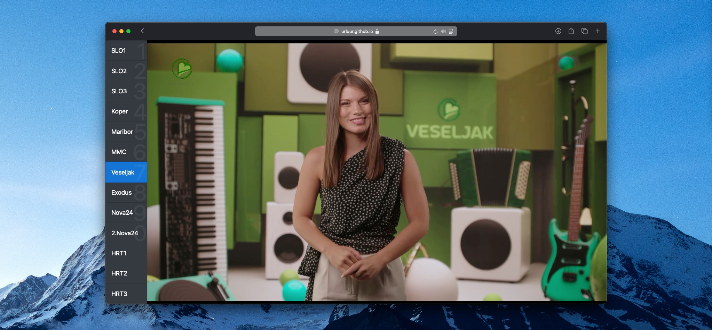

# SimplyTV

The programs Slovenian grandmas watch, which are actually free on the internet.

The website is targeted at the elderly people and is prioritising **ease of use**.



## Usage

### Local clone

Clone the repository and open the `index.html` file.

You can paste this in your terminal to start watching:

```sh
git clone https://github.com/urluur/SimplyTV.git
cd SimplyTV/
open index.html
```

## Shortcuts

You can switch to any channel with your keyboard.

| Channel | SLO 1 | SLO 2 | SLO 3 | Koper | Maribor | MMC | Veseljak | Exodus | Nova24 | 2.Nova24 | HRT 1 | HRT 2 | HRT 3 |
|-------|-----|-----|-----|-------|---------|-----|----------|--------|--------|----------|-------|-------|-------|
| Key   | 1   | 2   | 3   | 4     | 5       | 6   | 7        | 8      | 9      | 0        | Q     | W     | E     |

> [!TIP]
> You can set up Raspberry Pi to run this in kiosk mode, so it starts automatically when you turn it on.
> Then, you can buy a bluetooth keypad and use it to switch channels.
